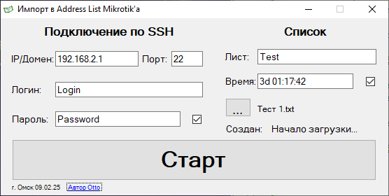

**Импорт в Address List Mikrotik'а** - Программа, позволяющая быстро импортировать большой список с IP адресами, масками или доменами в Address Lists Микротика.

Используется _.NET Framework 4.8_

Версия языка C#: _12.0_

_Проект полностью открыт и распространяется по лицензии MIT._

Ссылки на [GitHub](https://github.com/Otto17/AddAddressListMikrotik) и [GitFlic](https://gitflic.ru/project/otto/addaddressaistmikrotik).



---

**Пример использования:**

*   Заполняем поля для подключения через SSH и поле "Лист" (это название адрес листа);
*   Жмём на кнопку с "…", выбираем txt файл с ip-адресами(могут быть как с масками, так и без) или доменами (можно комбинированные ip и домны);
*   Если нужно создать динамический список, тогда, ставим галочку на "Время" и указываем время в том же формате, который поддерживает RouterOS (например: 05:17:00 или 2d 00:37:25, либо  2d00:37:25);
*   Жмём кнопку “Старт”, список загрузится.
    
    Соединение шифруется, поэтому можно использовать подключение как в ЛС, так и через интернет.
    

---

**Возможности:**

Поддерживается 3 типа записей в txt файле для импорта:

1\. Каждый адрес с новой строки:

```plaintext
1.1.1.0/11
2.2.2.0/22
3.3.3.0
test.test
```

2\. Адреса через запятую (не имеет значения с пробелами или без них):

```plaintext
1.1.1.0/11, 2.2.2.0/22,3.3.3.0/32,test.test, 4.4.4.0
```

3\. Комбинированный тип (как с новой строки, так и через запятую):

```plaintext
1.1.1.0/11,2.2.2.0/22, ss.test
2.2.2.0/11
3.3.3.0/22
4.4.4.0,
test.test
5.5.5.0/32, test.test,6.6.6.0
test2.test
```

---

P.S. Перед первым запуском BAT скрипта "**Объединить все DLL в EXE.bat**" в Visual Studio сначала установить через "**Консоль диспетчера пакетов**" пакет "**ILMerge**" командой "**install-package ILMerge**", это действие скачает скомпилированный файл в "_%USERPROFILE%\\.nuget\\packages\\ilmerge\\3.0.41\\tools\\net452\\ILMerge.exe_" затем можно сразу же его удалить командой "**uninstall-package ILMerge**" (либо использовать "**Управление пакетами NuGet…**" для визуальной установки и удаления).

После удаления бинарный файл "**ILMerge.exe**" останется в системе у пользователя, что удобно. Теперь можно запускать BAT скрипт "**Объединить все DLL в EXE.bat**".

---

**Автор Otto, г. Омск 2025**
